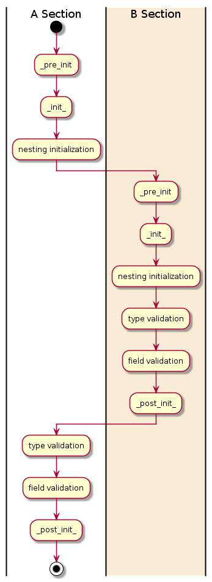

Dataclassutils
==============

|python| |Build Status| |Coverage|

Dataclassutils is a Python library for dealing with Python dataclasses.
It provides features to the Python standard dataclass such as recursive
initialization and type validation at runtime.

Installation
============
You can use pip or pipenv to install this package:

.. code-block:: bash

   pip install dataclassutils

Getting started
===============

.. code-block:: python

   from c11h.dataclassutils import dataclass

   @dataclass(validate=True)
   class Pepe:
       a: int

   Pepe(**{'a': 1}) # Here we go!

Features
========
Some of this package's main features are:

- Recursive initialization: Given a dataclass `A` owning a property that is an
  object of a dataclass `B`, upon initialization of `A`, `B`'s object will
  be automatically instantiated (and recursion will be applied if needed).
  Recursive initialization is defined through the use of a custom wrapper.

- Type validation: Naturally, static typing will be used for hinting, but it
  will also be used to perform type validation at runtime when trying to
  instantiate a dataclass object.

- Optional fields: To declare an optional field you no longer need to default
  the property (and consequently run into the annoying problem of default
  inheritance). With this wrapper, you can define optional fields with Typing or
  field property and define the defaulted value that will be assigned in case
  that no value is provided. If that is the case the field will be handled as if
  it was not present in the first place.

- Ignore additional properties: In a JSON schema definition you can allow
  additional properties. As dataclasses are often instantiated with
  dictionaries, you can set this property if you want to ignore any 
  additional field present in the input that is not defined in the class.

- Specific field validation: This capability (which is present in attrs) allows
  you to run specific validation on a defined field in the class. It will be
  checked upon instantiation.

  Supported typings:
        - Type_X (being Type_X a defined class)
        - List
        - Dict
        - Dict[str, Type_X]
        - Union[Type_X, Type_Y]
        - Enums
        - List[Type_X]
        - Optional[Type_X]
        - Optional[List[Type_X]]
    

Setup
=====
It is highly recommended to develop this project in a virtual environment.

Example for starting and using a virtual environment (you are free to use your
own/preferred setup):

.. code-block:: bash

  dataclassutils$ pip install virtualenv
  dataclassutils$ virtualenv env -p python3.7
  dataclassutils$ source env/bin/activate

Development
=======================
Building a package can be done with pip:

.. code-block:: bash

  dataclassutils$ pip wheel -w wheel --no-index --no-deps .

To use it, install it into some virtual environment and import it:

.. code-block:: bash

  dataclassutils$ pip install wheel/*
  dataclassutils$ python
  dataclassutils >>> import c11h.dataclassutils
  dataclassutils >>> # here we go!
  
Code Examples
=======================

Validate a dataclass
--------------------

>>> from c11h.dataclassutils import dataclass
>>> @dataclass(nest=True, validate=True)
... class A:
...     a: int
 
>>> A(**{'a':1}) # Sucess!

>>> A(**{'a':'1'}) # Will fail since the flag validate is set to True and it will validate it in runtime
Traceback (most recent call last):
  File "<stdin>", line 1, in <module>
  File "/*/*/dataclassutils/src/c11h/dataclassutils/re_wrap.py", line 88, in wrapper
    __init__(self, *args, **defaulted_kwargs)
  File "<string>", line 3, in __init__
  File "*/*/dataclassutils/src/c11h/dataclassutils/re_wrap.py", line 116, in wrapper
    _pre_post_init(self, validate, nest)
    raise NestedInitializationException(nest_errors)
c11h.dataclassutils.util.exceptions.NestedInitializationException: {'a': "'1' is of type '<class 'str'>' instead of '<class 'int'>'"}

Export a dataclass
------------------

>>> from c11h.dataclassutils import asdict

>>> asdict(A(**{'a':1}))
{'a': 1}

Ignore additional properties
----------------------------

>>> from c11h.dataclassutils import dataclass
>>> @dataclass(validate=True, ignore_additional_properties=True)
... class A:
...     a: int

>>> A(**{'a':1, 'b': 2}) # Success!!

Declare optional fields
-----------------------

>>> from typing import List, Optional
>>> from c11h.dataclassutils import dataclass, field
>>> @dataclass(validate=True)
... class A:
...     a: int 
...     b: Optional[str]
...     c: List = field(default_optional_value=[])

>>> A(**{'a':1}) # Success!!

Nested initialization
---------------------

>>> from c11h.dataclassutils import dataclass

>>> @dataclass(nest=True, validate=True)
... class B:
...     c: int
 
>>> @dataclass(nest=True)
... class A:
...     a: int
...     b: B
 
>>> A(**{'a':1, 'b': {'c': 2}}) # Success!!

Execution Flow
=============

Taking the previous example of nested initialization, the execution flow when
we instantiate the class would be:

Note: Take in consideration that in the step `nesting initialization`. Errors
will be cached and gathered in case that a composite class could not be
instantiated.

Test
====

It is very important to write test so we know that the functionality of this
package works as it is supposed to do. This package run tests using `pytest
<https://docs.pytest.org/en/latest/>`_ . To run them just run:

.. code-block:: bash

     dataclassutils$ pip install -e .
     dataclassutils$ pip install pytest
     dataclassutils$ pytest

Versioning
==========

In this project we follow `semantic versioning <https://semver.org/>`_ ,
be sure that you upgrade the current version when submitting a PR in an
appropriate way according to API changes,
functionality changes (in a backward-compatible manner) and patches.

Contributing
=======================

Merge requests are welcome, **please we encourage you to follow our project
standards. They can be checked with the project configuration for flake8
and mypi.**

For major changes, please open an issue first to
discuss what you would like to change.

Please make sure to update tests as appropriate.

And most important, have fun and happy coding!

.. |python| image:: https://img.shields.io/badge/python-3.7-brightgreen.svg
   :target: http://nexus.cogno.int/#browse/browse:pypi-hosted:dataclassutils

.. |Build Status| image:: https://git.c11h.com/health/dataclassutils/badges/master/pipeline.svg
   :target: https://git.c11h.com/health/dataclassutils/commits/master

.. |Coverage| image:: https://git.c11h.com/health/dataclassutils/badges/master/coverage.svg
   :target: https://git.c11h.com/health/dataclassutils/commits/master
